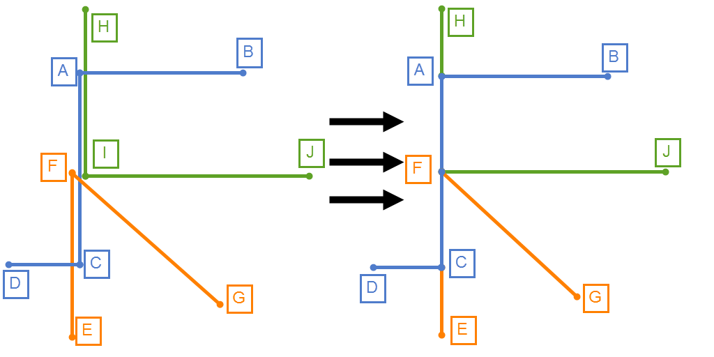

# Data cleaning procedures

With a given `.json` db file, data cleaning prepare a dataframe to fit models futher. Script-to-run is `corners_clean.py`, while other code is located at `data_cleaning` folder. 

## TL;DR

`python corners_clean.py`

Loads `%DBFILENAME%.json` and saves multitple files.

- `%DBFILENAME%.json-clustered` with clustered graph;
- `%DBFILENAME%.json-cleaned.json` clustered graph, in the formap, appropriate for web-service;
- `../images/*.png` every corner as separate PNG;
- `%DBFILENAME%.json-corners-df.csv` contains corner label and additional metadata. `N_examples` of rows, for classification
- `%DBFILENAME%.json-corners-df.csv-data.npy` contains corner data of shape `(N_examples, 576)`
- `%DBFILENAME%.json-edges-df.csv` contains edge label and additional metadata. `N_examples` of rows, for classification
- `%DBFILENAME%.json-edges-df.csv-data.npy` contains edge data of shape `(N_examples, 360)`

## 1. Data cleaning

For every marked image in db file, `data-cleaning` builds a simplified graph. It cluster corner points, remove duplicated edges, and finally builds a graph where each corner have edges only to its direct neighbours.

After this step, clusterized graph is saved in two formats:

1. just clusterized graph: `%DBFILENAME%.json-clustered`
2. DB file, where all markdowns are simplified (ready to use in web service): `%DBFILENAME%.json-cleaned.json`

## 2. Corners as PNG

in `../images/` folder every corner is saved as separate image. Original appartment image is saved too.

## 3. Corners datarame for classification

Corners are also saved in the handy format for the future classification.

For every corner 48 data augmentations are used:

`((original corner) + (5 random transformations)) * (8 mirroring and rotating)`

For every data augmentation, newighbourhood `32x32` is used. After transformations, it is resized to shape of `24x24`.

Two files are saved:

1. Descriptive dataframe includes meta data:

	1. example label (0 for non-corners, 1.. for corners)
	2. image_id
	3. image width, image height
	4. original corner size
	5. used random offset for x, y
	6. used random rotation (-45..45 degrees)
	7. final direction (1..8)

  Dataframe is saved at `%DBFILENAME%.json-corners-df.csv` 
2. Data array of shape `(N_examples, 576)` is saved to `%DBFILENAME%.json-corners-df.csv-data.npy`

Also, appropriate amount of non-corners is added. So, if originally there was 10 corners, final dataframe has `10*48` examples with corners and `10*48` examples of non-corners, 960 rows in total.

### corners labels

Every example receives one of the next labels:

- `0` - non-corner
- `1` - flat corner (where angle between two edges is > 90)
- `2` -  one-neighboured corner (with just one edge)
- ...
- `N+1` - N-neighboured corner (with N edges)

## 4. Edges dataframe for classification

For each pair of corners we define if there is a wall. Each may-be-an-edge between two corners is resized to `12x30` grayscale image.

The main logic is almost the same as with corner dataframe, two files are saved:

1. Descriptive dataframe includes meta data:

	1. example label (0 for non-edges, 1 for edges)
	2. image_id
	3. image width, image height
	4. wall start, wall end points
	7. final direction (1..4)

  Dataframe is saved at `%DBFILENAME%.json-edges-df.csv` 
2. Data array of shape `(N_examples, 360)` is saved to `%DBFILENAME%.json-edges-df.csv-data.npy`

Usually one image contains ~20 corners. For each corners pair we get a label edge/non-edge; so, `20*(20-1)/2=190` examples received. About 40 of them are edges, while other are non-edges.

