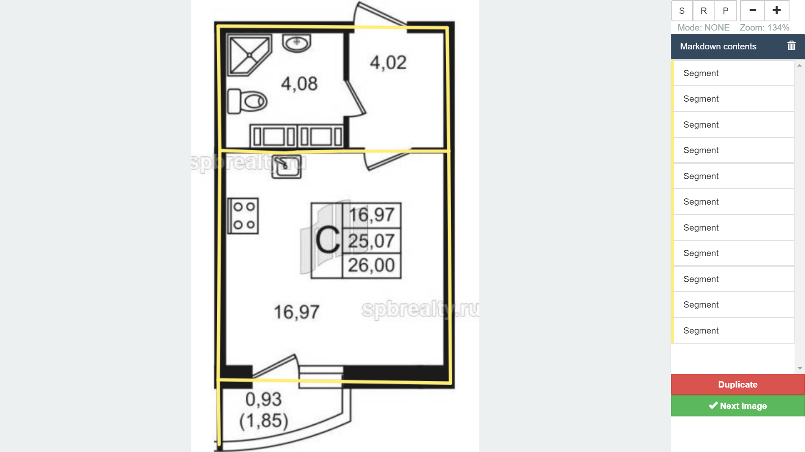

# Web service

Web-service is aimed to markdown appartments' plannings. Script-to-run is `run.py`, while other code is located at `app` folder.

## How to use

After [start](#how-to-start), web-interface is accessible at `localhost:8000`. You may open the web-page and start marking images.

There are three types of marking objects (right upper corner):

1. **Segment** connects two points
2. **Region** creates a rectangle between two points (upper-left and bottom-right, or upper-right and bottom-left) and gives 4 edges
3. **Polyline** creates a N-1 edges between N points

After finishing image, you may push `Next image` button. It saves your markdown to DB and moves you to the next image. If markdown is empty, than nothing is saved.

`Duplicate` button mark this image as duplicated one. It means that almost the same image was already marked, and servise should not propose this image to user anymore.

## How to start:  

### Start locally  

1. Start service: `python run.py`  
2. Open main page: `localhost:8000`  
3. use web-service(opened `^^^`) or API calls (`vvv`)

### Start in docker  

1. Build docker container: `docker-compose up`  
2. Open main page: `localhost:8000`  
3. use web-service(opened `^^^`) or API calls (`vvv`)  

## Web-pages structure:

### root

[http://localhost:8000](http://localhost:8000)  
redirects to the first unmarked image

### image page
[http://localhost:8000/123](http://localhost:8000/123)  
shows the template with picture by id

## Backend API:  

### ID for next not marked image 
**Request:**   
[GET] [http://localhost:8000/next](http://localhost:8000/next)  
**Answer:**  

	{next_unmarked_picture: 0}

### ID for next not marked image, but not less that %param%
**Request:**  
[GET] [http://localhost:8000/next/123](http://localhost:8000/next/123)  
**Answer:**  

	{next_unmarked_picture: 124}

### Get image by ID

**Request:**  
[GET] [http://localhost:8000/image/123](http://localhost:8000/image/123)  
**Answer:**  

	<image>

Returns image, `mimetype=image/jpeg`  

### Get previously saved markdown for image

**Request:**  
[GET] [http://localhost:8000/image/123/markdown](http://localhost:8000/image/123/markdown)  
**Answer:**  

	{
	<json here>
	}

Returns previously saved `json` or `{}` if nothing was saved.

### Save markdown for image

**Request:**  
[POST] [http://localhost:8000/image/123/markdown](http://localhost:8000/image/123/markdown)  
Payload: any json

	POST /image/1/markdown HTTP/1.1
	HOST: 127.0.0.1:8000
	content-type: application/json
	content-length: 19
	
	{"text":"blabla_1"}
	

**Answer:**  

	{
	msg: "ok"
	}

Saves json for image

### Is image duplicated

**Request:**  
[GET] [http://localhost:8000/image/123/duplicate](http://localhost:8000/image/123/duplicate)  
**Answer:**  

	True / False

Return if user clicked "duplicate" for this image

### Mark image as duplicated

**Request:**  
[POST] [http://localhost:8000/image/123/duplicate?duplicate=true](http://localhost:8000/image/123/duplicate?duplicate=true)  

Mark image as duplicated. Such image will not be proposed to markdown further.

**Answer:**  

	{
	msg: "ok"
	}